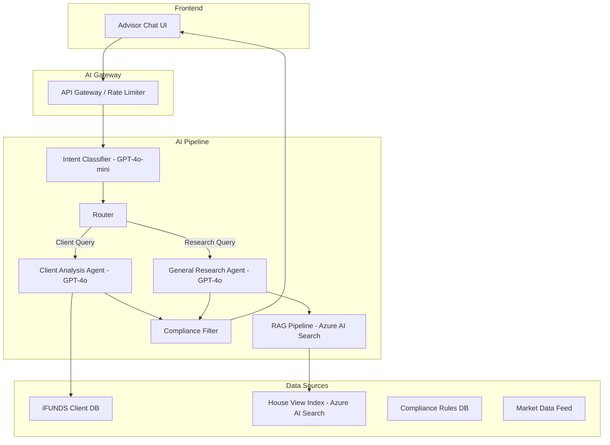
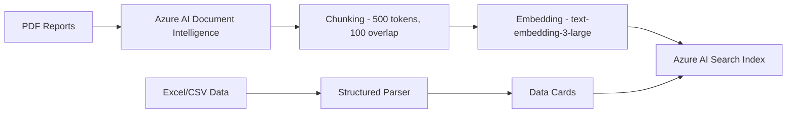

# AI & Machine Learning Development Guide — DORA System

> **Audience**: AI/ML Development Team  
> **Purpose**: Technical specification for building production ML models and AI pipelines for the DORA system  
> **Version**: 1.0 | February 2026

---

## Table of Contents
1. [System Overview](#system-overview)
2. [Current DORA Architecture](#current-dora-architecture)
3. [Production AI Architecture](#production-ai-architecture)
4. [Intent Classification Model](#intent-classification-model)
5. [RAG Pipeline — House Views & Research](#rag-pipeline)
6. [Client-Specific Response Generation](#client-specific-response-generation)
7. [Compliance & Guardrails](#compliance--guardrails)
8. [Talking Points ML Model](#talking-points-ml-model)
9. [Next Best Action Engine](#next-best-action-engine)
10. [Data Requirements](#data-requirements)
11. [Model Training & Evaluation](#model-training--evaluation)
12. [Azure Infrastructure](#azure-infrastructure)
13. [Prompt Engineering Guidelines](#prompt-engineering-guidelines)
14. [Implementation Roadmap](#implementation-roadmap)

---

## 1. System Overview

DORA (Digital Operations & Recommendations Assistant) is the AI engine powering the Advisor Co-Pilot. It serves two primary functions:

1. **Client-Specific Intelligence** — Portfolio analysis, goal tracking, risk assessment, and recommendations for individual clients
2. **General Research Tool** — House views on sectors, countries, currencies, and investment strategies

### User Interactions
- **Chat** (natural language queries via the DORA chat widget)
- **Auto-Generated Content** (talking points, next best actions, daily briefings)
- **Alerts** (proactive notifications about off-track goals, rebalancing needs)

---

## 2. Current DORA Architecture (Prototype)

The prototype uses a **rule-based** system. This section documents the exact logic that the AI team must replicate and improve upon.

### 2.1 Intent Classification (Regex-Based)

**File**: `server/dora.ts` — `parseIntent(message: string): Intent`

The current system uses 12 regex pattern groups to classify user messages:

```
Intent                  Pattern Examples
───────────────────     ──────────────────────────────────────────
portfolio_summary       portfolio, holdings, aum, invested, overview
goal_status             goal, target, progress, on track, off track
risk_metrics            risk, volatil, sharpe, drawdown, var
cash_analysis           cash, liquid, uninvested, idle
off_track               off track, behind, failing, underperform, danger
dca_analysis            dca, monthly, contribution, auto invest
rebalancing             rebalanc, drift, misalign, over weight, under weight
recommendations         recommend, suggest, what should, advise, optimize
comparison_cash         which client cash, who cash
comparison_offtrack     which client off track, who needs attention
meeting_points          meeting, talking point, prep, agenda
client_info             age, profile, income, who is, tell me about
knowledge_base          house view, outlook, inflation, tech, healthcare,
                        Philippines, USD/PHP, ESG, interest rate, etc.
```

**Fallback**: If no pattern matches → `"unknown"` → falls through to RAG search.

### 2.2 Response Generation (Heuristic)

**File**: `server/dora.ts` — `generateResponse(intent, message, client, allClients)`

Each intent has a dedicated handler that queries client data and builds structured responses:

```typescript
interface DoraResponse {
  text: string;                          // Markdown-formatted response
  data?: { label: string; value: string; color?: string }[];  // Data cards
  actions?: { label: string; type: "info" | "warning" | "action" }[];
  complianceBadge?: "approved" | "needs_review" | "informational";
}
```

### 2.3 RAG System (Mock)

**File**: `server/rag.ts` — `queryRAG(query: string): RAGResult`

Currently contains **24 mock documents** organized by topic:

| Category | Topics Covered |
|----------|---------------|
| **Sectors** | Technology, Healthcare, Financials, Energy, Real Estate, Consumer |
| **Countries** | Philippines, US, China, India, Japan, ASEAN |
| **Currencies** | USD/PHP, CNY/USD, JPY/USD |
| **Asset Classes** | Equities, Fixed Income, Commodities |
| **Strategies** | ESG, Dividends, DCA, Retirement, Tax Efficiency |
| **Macro** | Inflation, Interest Rates |

Each document has:
```typescript
{
  id: string;
  topic: string;
  keywords: string[];          // For matching
  content: string;             // The actual house view text
  complianceNote: string;      // Regulatory disclaimer
  source: string;              // Source document reference
}
```

**Matching logic**: Combines topic matching + keyword overlap with relevance scoring.

---

## 3. Production AI Architecture

### Recommended Stack



### Azure Services Required

| Service | Purpose | SKU Recommendation |
|---------|---------|-------------------|
| **Azure OpenAI Service** | LLM inference (GPT-4o, GPT-4o-mini) | S0 tier, 100K TPM |
| **Azure AI Search** | Vector search for RAG | S1 tier |
| **Azure AI Document Intelligence** | PDF/document extraction | S0 tier |
| **Azure Blob Storage** | Document store for house views | Standard LRS |
| **Azure API Management** | Rate limiting, auth, logging | Standard tier |
| **Azure Monitor** | Logging, metrics, alerts | Standard |

---

## 4. Intent Classification Model

### Option A: LLM-Based (Recommended)

Use GPT-4o-mini for fast, accurate classification:

```python
SYSTEM_PROMPT = """
You are an intent classifier for a financial advisor assistant.
Classify the user's message into exactly one intent:

1. portfolio_summary - Questions about portfolio value, composition, AUM
2. goal_status - Questions about goal progress, on/off track
3. risk_metrics - Questions about risk, volatility, Sharpe ratio, drawdown
4. cash_analysis - Questions about cash holdings, liquidity
5. recommendations - Requests for advice, suggestions, actions
6. knowledge_base - Questions about market views, sectors, countries, strategies
7. meeting_points - Meeting preparation, agendas, talking points
8. rebalancing - Portfolio drift, rebalancing needs
9. comparison - Cross-client comparisons
10. client_info - Client demographics, profile information

Respond with ONLY the intent name, nothing else.
"""
```

**Latency target**: < 200ms (use GPT-4o-mini with streaming disabled)

### Option B: Fine-Tuned Classification Model

If latency is critical (< 50ms), fine-tune a BERT-based model:

#### Training Data Schema
```json
{
  "text": "How is Maria's retirement goal looking?",
  "intent": "goal_status",
  "entities": {
    "client_name": "Maria",
    "goal_type": "retirement"
  }
}
```

#### Recommended Model
- **Base**: `bert-base-multilingual-cased` (supports Filipino/English code-switching)
- **Training set**: 5,000+ labeled examples (800+ per intent)
- **Validation**: 20% holdout, target F1 > 0.92

---

## 5. RAG Pipeline — House Views & Research

### Document Ingestion Pipeline



### Document Processing Steps

1. **Extract**: Use Azure AI Document Intelligence to parse PDFs (handles charts, tables, images)
2. **Chunk**: Split documents into 500-token chunks with 100-token overlap
3. **Embed**: Generate embeddings using `text-embedding-3-large` (3072 dimensions)
4. **Index**: Store in Azure AI Search with metadata filters

### Index Schema
```json
{
  "name": "house-views-index",
  "fields": [
    { "name": "id", "type": "Edm.String", "key": true },
    { "name": "content", "type": "Edm.String", "searchable": true },
    { "name": "content_vector", "type": "Collection(Edm.Single)", "dimensions": 3072 },
    { "name": "source_document", "type": "Edm.String", "filterable": true },
    { "name": "category", "type": "Edm.String", "filterable": true },
    { "name": "region", "type": "Edm.String", "filterable": true },
    { "name": "sector", "type": "Edm.String", "filterable": true },
    { "name": "publish_date", "type": "Edm.DateTimeOffset", "filterable": true },
    { "name": "expiry_date", "type": "Edm.DateTimeOffset", "filterable": true },
    { "name": "compliance_status", "type": "Edm.String", "filterable": true }
  ]
}
```

### Retrieval Strategy
1. **Hybrid Search**: Combine vector similarity (70%) + keyword BM25 (30%)
2. **Filters**: Apply category/region/sector filters based on intent entities
3. **Top-K**: Retrieve top 5 chunks
4. **Reranking**: Use cross-encoder for final relevance scoring
5. **Recency bias**: Boost documents published within last 90 days

### RAG Prompt Template
```python
RAG_PROMPT = """
You are DORA, Manulife's AI research assistant for financial advisors.

Context from Manulife house views:
{retrieved_chunks}

Compliance notes:
{compliance_notes}

Guidelines:
- Answer ONLY based on the provided context
- If the context doesn't contain relevant information, say "I don't have a current house view on this topic. Please check with the Research team."
- Always cite the source document
- Use simple, jargon-free language suitable for client conversations
- Include the compliance status of the information
- Mention the publication date if relevant

Advisor's question: {user_query}
"""
```

---

## 6. Client-Specific Response Generation

### Data Context Window

When a client is selected, the LLM receives a **structured data summary** (not raw DB dumps):

```python
CLIENT_CONTEXT = """
Client Profile:
- Name: {name}, Age: {age}, Risk Profile: {risk_profile}
- Total AUM: ₱{total_portfolio:,.0f}
- Cash Holdings: ₱{cash_holdings:,.0f} ({cash_pct:.1f}%)
- YTD Return: {ytd_return}%

Goals:
{goal_summaries}

Alerts:
{active_alerts}

Recent Interactions:
{meeting_history}
"""
```

### Calculation Functions to Replicate

The following calculation functions from `client/src/lib/mockData.ts` must be replicated on the server side for DORA responses:

| Function | Purpose | Formula |
|----------|---------|---------|
| `getClientRiskMetrics(client)` | Portfolio-weighted risk | `Σ(goalMetrics × goalWeight)` |
| `getGoalRiskMetrics(goal)` | Fund-weighted risk per goal | `Σ(fundMetric × fundWeight/totalWeight)` |
| `getClientWeightedReturns(client)` | Portfolio-weighted returns | `Σ(goalReturn × goalInvestedWeight)` |
| `getClientFundExposure(client)` | Fund-level aggregation | Sum amounts across goals per fund |
| `formatPHP(amount)` | Currency formatting | `Intl.NumberFormat("en-PH", { style: "currency", currency: "PHP" })` |

### Response Structure
```typescript
{
  text: string;           // Markdown-formatted narrative
  data?: DataCard[];      // Structured metric cards (max 6)
  actions?: ActionChip[]; // Follow-up action suggestions (max 5)
  complianceBadge?: string;
  sources?: string[];     // Document references
}
```

---

## 7. Compliance & Guardrails

### Content Safety Rules

1. **No investment guarantees** — Never predict specific returns
2. **No unauthorized products** — Only recommend Manulife-approved funds
3. **Disclosure requirements** — Always include compliance status
4. **Philippines context** — Responses must be relevant to PH regulations (SEC, BSP, AMLA)
5. **Client suitability** — Recommendations must align with client's risk profile

### Guardrail Prompt
```python
GUARDRAIL_SYSTEM = """
You MUST follow these rules:
1. Never guarantee investment returns or predict specific market movements
2. Always include a disclaimer when discussing market views
3. If asked about a product not in the approved list, say "This product is not part of our current offering. Please discuss alternatives with your product team."
4. Do not provide tax advice — redirect to qualified tax professionals
5. All recommendations must consider the client's stated risk profile
6. Flag any response that discusses tax, legal, or estate planning as "needs_review"
"""
```

### Compliance Classification

```python
def classify_compliance(response_text: str, intent: str) -> str:
    """Returns: 'approved', 'needs_review', or 'informational'"""
    if intent == "knowledge_base":
        return "approved"  # Pre-vetted house views
    elif intent in ["recommendations", "rebalancing"]:
        return "needs_review"  # Advisor must verify
    elif intent in ["portfolio_summary", "goal_status", "client_info"]:
        return "informational"  # Factual data
    else:
        return "informational"
```

---

## 8. Talking Points ML Model

The prototype generates talking points using rule-based logic. The AI team should build an ML model that:

### Input Features
```json
{
  "client_profile": { "age": 35, "risk_profile": "Balanced", "tenure_months": 36 },
  "portfolio": { "aum": 5200000, "ytd_return": 8.3, "cash_pct": 25 },
  "goals": [
    { "type": "education", "status": "on-track", "probability": 82, "gap_pct": 40 },
    { "type": "retirement", "status": "off-track", "probability": 58, "gap_pct": 72 }
  ],
  "market_context": { "psei_weekly": 1.2, "bsp_rate": 6.5, "inflation": 4.2 },
  "last_meeting": { "days_ago": 45, "open_follow_ups": 3 },
  "seasonal": { "month": 2, "is_year_end": false, "tax_season": false }
}
```

### Output
```json
{
  "talking_points": [
    {
      "priority": 1,
      "category": "concern",
      "title": "Retirement goal needs attention",
      "script": "Juan, I wanted to discuss your retirement goal. It's currently tracking at 58% probability, which is below our comfort zone. We have a few options to explore...",
      "follow_up_question": "Would you be comfortable increasing your monthly contribution by ₱2,000?"
    }
  ]
}
```

### Model Approach
- **Option 1**: Fine-tuned GPT-4o with structured output (recommended for MVP)
- **Option 2**: Custom sequence model trained on advisor meeting transcripts (for scale)

---

## 9. Next Best Action Engine

### Scoring Model

Build a scoring model that ranks possible actions by expected impact:

```
Score = (Urgency × 0.4) + (Client_Impact × 0.3) + (Compliance_Weight × 0.2) + (Revenue_Impact × 0.1)
```

### Action Types & Scoring Criteria

| Action Type | Urgency Score Logic | Client Impact Logic |
|-------------|--------------------|--------------------|
| **Rebalancing** | Drift > 10% → High | Based on portfolio size |
| **Contribution Increase** | Goal off-track → High | Based on gap size |
| **Product Switch** | Underperforming fund → Medium | Based on amount in fund |
| **KYC Renewal** | Days until expiry → escalating | Regulatory requirement |
| **Meeting Follow-Up** | Days since commitment → escalating | Based on follow-up type |

### ML Enhancement (Future)
- Train on historical advisor actions and client outcomes
- Features: client profile, market conditions, similar client cohort outcomes
- Target: predict which action the advisor is most likely to take AND which leads to best client outcomes

---

## 10. Data Requirements

### Training Data Needed

| Dataset | Source | Volume | Purpose |
|---------|--------|--------|---------|
| **Advisor chat logs** | iFUNDS CRM | 50,000+ conversations | Intent classification training |
| **House view documents** | Investment Management team | 200+ PDFs/quarter | RAG knowledge base |
| **Client interaction history** | iFUNDS | 100,000+ records | Next best action model |
| **Meeting transcripts** | Advisor recordings (opt-in) | 5,000+ sessions | Talking points model |
| **Market data** | Bloomberg / Reuters | Daily | Context enrichment |
| **Compliance rulings** | Legal/Compliance team | 500+ | Guardrail training |

### Data Privacy
- All training data must be anonymized before model training
- No raw PII should be included in any model
- Client IDs must be masked or tokenized
- Compliance team must approve all training datasets

---

## 11. Model Training & Evaluation

### Evaluation Metrics

| Model | Primary Metric | Target | Secondary Metrics |
|-------|---------------|--------|------------------|
| **Intent Classifier** | Multi-class F1 | > 0.92 | Per-class precision, latency < 200ms |
| **RAG Retrieval** | NDCG@5 | > 0.85 | MRR, recall@10 |
| **Response Quality** | Human eval (1-5) | > 4.0 | Factual accuracy, helpfulness, compliance |
| **Talking Points** | Advisor acceptance rate | > 70% | A/B test vs rule-based |
| **Next Best Action** | Action completion rate | > 40% | Revenue impact, client retention |

### A/B Testing Framework
1. **Baseline**: Current rule-based system (prototype)
2. **Treatment**: LLM-powered system
3. **Metrics**: Advisor engagement time, actions taken, client satisfaction (NPS)
4. **Sample**: 200+ advisors, 4-week test period

---

## 12. Azure Infrastructure

### Resource Group Layout
```
rg-advisor-copilot-prod
├── openai-advisor-copilot        (Azure OpenAI)
├── search-advisor-copilot        (Azure AI Search)
├── docint-advisor-copilot        (Document Intelligence)
├── storage-advisorcopilot        (Blob Storage)
├── apim-advisor-copilot          (API Management)
├── monitor-advisor-copilot       (Azure Monitor)
└── kv-advisor-copilot            (Key Vault)
```

### Model Deployments (Azure OpenAI)
```
Deployment Name          Model              Use Case
─────────────────        ─────────────      ──────────────────
gpt4o-chat               GPT-4o             Main response generation
gpt4o-mini-classifier    GPT-4o-mini        Intent classification
text-embed-3-large       text-embedding-3   RAG embeddings
```

### Cost Estimation (Monthly)
| Service | Usage | Est. Cost (USD) |
|---------|-------|----------------|
| Azure OpenAI (GPT-4o) | 500K input + 200K output tokens/day | $1,200 |
| Azure OpenAI (GPT-4o-mini) | 200K tokens/day | $100 |
| Azure AI Search (S1) | 1 replica, 1 partition | $250 |
| Document Intelligence | 5,000 pages/month | $75 |
| Blob Storage | 50 GB | $5 |
| API Management | Standard | $200 |
| **Total** | | **~$1,830/month** |

---

## 13. Prompt Engineering Guidelines

### System Prompts

#### DORA Main Persona
```
You are DORA (Digital Operations & Recommendations Assistant), an AI assistant for Manulife financial advisors in the Philippines.

Your personality:
- Professional but approachable
- Data-driven — always cite numbers and sources
- Concise — advisors are busy, keep responses under 200 words
- Philippines-aware — use PHP currency, reference local market (PSEi), BSP policies

Your capabilities:
1. Analyze client portfolios and goals
2. Provide Manulife house views on markets, sectors, and strategies
3. Generate meeting preparation materials
4. Suggest next best actions

You MUST:
- Always include compliance disclaimers on market views
- Never guarantee returns
- Flag recommendations as "needs_review" for the advisor
- Use ₱ for Philippine Peso amounts
```

#### Data Formatting Rules
```
When presenting data:
- Use bullet points for 3+ items
- Use data cards (JSON) for key metrics (max 6 cards)
- Format currency as ₱X.XM or ₱X.XK
- Format percentages to 1 decimal place
- Bold key numbers and action items
- Include comparison context (vs benchmark, vs last period)
```

### Anti-Hallucination Techniques
1. **Grounding**: Always provide RAG context — never rely on training data for market views
2. **Attribution**: Require the model to cite source documents
3. **Confidence scoring**: Have the model rate its confidence (1-5) and flag low-confidence responses
4. **Fact checking**: Cross-reference generated data cards against source data
5. **Canary tokens**: Include known-false statements in test prompts to measure hallucination rate

---

## 14. Implementation Roadmap

### Phase 1: Foundation (Weeks 1-4)
- [ ] Set up Azure OpenAI and AI Search instances
- [ ] Ingest 50+ house view documents into search index
- [ ] Implement LLM-based intent classifier (replace regex)
- [ ] Build basic RAG pipeline with hybrid search
- [ ] Deploy compliance guardrail prompts

### Phase 2: Client Intelligence (Weeks 5-8)
- [ ] Connect to iFUNDS client data APIs
- [ ] Build client context window generator
- [ ] Implement LLM-based response generation for all intent types
- [ ] Build talking points generator with LLM
- [ ] A/B test LLM vs rule-based responses

### Phase 3: Advanced Features (Weeks 9-12)
- [ ] Train/deploy next best action scoring model
- [ ] Add market data feed integration for real-time context
- [ ] Implement conversation memory (multi-turn)
- [ ] Build advisor feedback loop for continuous improvement
- [ ] Deploy monitoring and alerting

### Phase 4: Scale & Optimize (Weeks 13-16)
- [ ] Fine-tune intent classifier on production data
- [ ] Optimize prompts based on advisor feedback
- [ ] Add support for Filipino/Tagalog queries
- [ ] Performance optimization (< 2s response time)
- [ ] Security audit and penetration testing

---

*Document prepared for the Manulife AI Development Team. For questions, contact the Advisor Co-Pilot project lead.*
