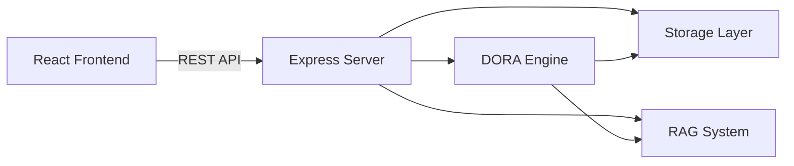
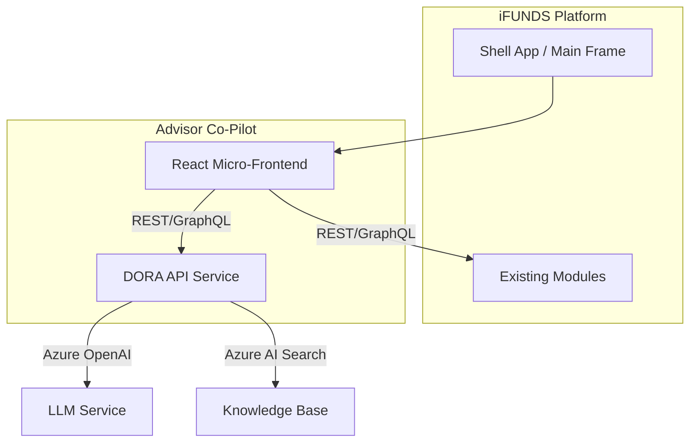
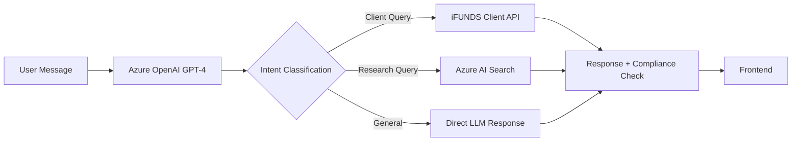

# IT Integration Guide — Advisor Co-Pilot → iFUNDS Platform

> **Audience**: IT Development Team  
> **Purpose**: Technical blueprint for integrating Advisor Co-Pilot features into the existing iFUNDS platform  
> **Version**: 1.0 | February 2026

---

## Table of Contents
1. [Architecture Overview](#architecture-overview)
2. [Technology Stack](#technology-stack)
3. [Component Inventory](#component-inventory)
4. [API Endpoints](#api-endpoints)
5. [Data Schema](#data-schema)
6. [Integration Strategy](#integration-strategy)
7. [DORA AI Integration](#dora-ai-integration)
8. [Client Intelligence Panel](#client-intelligence-panel)
9. [Real-Time Data Connections](#real-time-data-connections)
10. [Security & Compliance](#security--compliance)
11. [Deployment Considerations](#deployment-considerations)
12. [Migration Checklist](#migration-checklist)

---

## 1. Architecture Overview

The Advisor Co-Pilot prototype follows a **client-server monorepo** pattern:

```
manulife-advisor-copilot/
├── client/                 # React SPA (Vite + TypeScript)
│   └── src/
│       ├── components/     # Reusable UI components
│       ├── pages/          # Route-level page components
│       ├── hooks/          # Custom React hooks (data fetching)
│       ├── lib/            # Utilities, mock data, API client
│       └── App.tsx         # Main router & layout
├── server/                 # Node.js + Express API
│   ├── routes.ts           # REST API endpoint definitions
│   ├── storage.ts          # Data access layer (in-memory)
│   ├── dora.ts             # AI chat engine (intent + response)
│   ├── rag.ts              # RAG knowledge base (house views)
│   └── insights-engine.ts  # Alert/notification generation
└── shared/
    └── schema.ts           # Shared TypeScript types & Zod schemas
```

### Data Flow



**Key Point for iFUNDS**: The storage layer (`storage.ts`) currently uses in-memory data. For iFUNDS integration, this must be replaced with calls to your existing database services (Oracle/SQL Server) or microservice APIs.

---

## 2. Technology Stack

| Layer | Prototype | iFUNDS Equivalent (Suggested) |
|-------|-----------|-------------------------------|
| **Frontend** | React 18 + TypeScript + Vite | Embed as micro-frontend or integrate into existing Angular/React app |
| **UI Library** | Shadcn/UI (Radix primitives) | Map to iFUNDS design system or adopt Shadcn |
| **State Management** | TanStack Query (server state) | Continue with TanStack Query or use existing state management |
| **Routing** | Wouter (lightweight) | Use iFUNDS existing router (React Router / Angular Router) |
| **Animation** | Framer Motion | Keep or replace with CSS animations |
| **Backend** | Node.js + Express | Integrate into existing .NET/Java APIs or deploy as a Node microservice |
| **AI Chat** | Custom NLP (regex + heuristic) | Replace with Azure OpenAI Service / LLM API |
| **Knowledge Base** | In-memory docs (RAG mock) | Azure AI Search + Document Intelligence |
| **Storage** | In-memory Maps | iFUNDS Oracle/SQL database |
| **Validation** | Zod schemas | Continue with Zod or map to existing validation |

---

## 3. Component Inventory

### Pages (Route-Level Components)

| Component | File | Purpose | iFUNDS Integration |
|-----------|------|---------|-------------------|
| **AdvisorHome** | `pages/advisor-home.tsx` | Daily command center: briefing, tasks, quick actions, recent clients | New module in iFUNDS dashboard |
| **ClientsPage** | `pages/clients.tsx` | Searchable client directory with filters | Enhance existing client list |
| **Dashboard** | `pages/dashboard.tsx` | Client detail view: charts, goals, intelligence panel | Extend existing client profile |
| **AnalyticsPage** | `pages/analytics.tsx` | Cross-client portfolio analytics | New analytics module |
| **SettingsPage** | `pages/settings.tsx` | Advisor preferences | Integrate into iFUNDS settings |

### Dashboard Sub-Components

| Component | File | Data Dependencies |
|-----------|------|-------------------|
| **ClientIntelligencePanel** | `dashboard/client-intelligence-panel.tsx` | Client goals, returns, meetingNotes, needsAction |
| **PortfolioAllocationChart** | `dashboard/portfolio-allocation-chart.tsx` | Client fund allocations |
| **PerformanceHistoryChart** | `dashboard/performance-history-chart.tsx` | Time-series return data |
| **BenchmarkComparisonCard** | `dashboard/benchmark-comparison.tsx` | Client returns vs PSEi/balanced benchmark |
| **ContributionTracker** | `dashboard/contribution-tracker.tsx` | Monthly contribution data |
| **PortfolioDriftSection** | `dashboard/portfolio-drift.tsx` | Target vs actual allocation |
| **PeerComparisonChart** | `dashboard/peer-comparison.tsx` | Cross-client cohort data |
| **AttributionBreakdown** | `dashboard/attribution-breakdown.tsx` | Return attribution by asset class |
| **GoalCard** | `dashboard/goal-card.tsx` | Individual goal progress |
| **MeetingPrepDialog** | `dashboard/meeting-prep-dialog.tsx` | Goals, performance, meeting notes |
| **ClientTimeline** | `dashboard/client-timeline.tsx` | Interaction history events |

### Shared Components

| Component | File | Purpose |
|-----------|------|---------|
| **DoraChat** | `components/dora-chat.tsx` | AI chat interface (messages, typing, quick actions) |
| **AppSidebar** | `components/app-sidebar.tsx` | Navigation sidebar |
| **CommandMenu** | `components/command-menu.tsx` | Global search (⌘K) |
| **NotificationCenter** | `components/notification-center.tsx` | Alert bell with DORA insights |
| **GoalWizard** | `components/goal-wizard.tsx` | Multi-step goal creation flow |
| **MetricTooltip** | `components/metric-tooltip.tsx` | Educational popover for metrics |
| **MeetingDebrief** | `components/advisor/meeting-debrief.tsx` | Post-meeting notes capture |
| **DailyBriefing** | `components/advisor/daily-briefing.tsx` | Market data + greeting |
| **TaskInbox** | `components/advisor/task-inbox.tsx` | Aggregated compliance alerts |

---

## 4. API Endpoints

All endpoints are defined in `server/routes.ts`. The table below shows what needs to be mapped to iFUNDS services.

### Client & Goal APIs

| Method | Endpoint | Purpose | iFUNDS Mapping |
|--------|----------|---------|----------------|
| `GET` | `/api/clients` | List all clients | Query iFUNDS client database |
| `GET` | `/api/clients/:id` | Get single client with goals | Join client + goals + portfolio tables |
| `POST` | `/api/clients` | Create new client | Insert into iFUNDS client system |
| `PATCH` | `/api/clients/:id` | Update client | Update iFUNDS client record |
| `DELETE` | `/api/clients/:id` | Delete client | Soft-delete in iFUNDS |
| `POST` | `/api/clients/:id/goals` | Add goal to client | Insert into goals table |
| `PATCH` | `/api/clients/:id/goals/:goalId` | Update goal | Update goals table |
| `DELETE` | `/api/clients/:id/goals/:goalId` | Delete goal | Soft-delete goal |

### Model Portfolio APIs

| Method | Endpoint | Purpose |
|--------|----------|---------|
| `GET` | `/api/model-portfolios` | List all model portfolios |
| `GET` | `/api/model-portfolios/risk/:riskProfile` | Filter by risk level |
| `GET` | `/api/model-portfolios/:id` | Get single portfolio |
| `POST` | `/api/model-portfolios` | Create (validates fund weights = 100%) |
| `PATCH` | `/api/model-portfolios/:id` | Update (re-validates weights) |
| `DELETE` | `/api/model-portfolios/:id` | Delete |

### AI & Intelligence APIs

| Method | Endpoint | Purpose | iFUNDS Integration |
|--------|----------|---------|-------------------|
| `POST` | `/api/dora/chat` | AI chat (message + optional clientId) | Route to Azure OpenAI |
| `GET` | `/api/dora/alerts` | Actionable insights/alerts | Connect to iFUNDS alert engine |
| `POST` | `/api/rag/chat` | House views knowledge query | Connect to Azure AI Search |
| `POST` | `/api/trade/execute` | Trade execution (with auth) | Route to iFUNDS trade system |

### Request/Response Examples

**DORA Chat Request:**
```json
POST /api/dora/chat
{
  "message": "What's our house view on technology?",
  "clientId": "c1"  // optional
}
```

**DORA Chat Response:**
```json
{
  "response": {
    "text": "Manulife's house view on Technology...",
    "data": [
      { "label": "Recommendation", "value": "Overweight", "color": "green" },
      { "label": "Confidence", "value": "High", "color": "blue" }
    ],
    "actions": [
      { "label": "View detailed report", "type": "info" }
    ],
    "complianceBadge": "approved"
  },
  "intent": "knowledge_base"
}
```

---

## 5. Data Schema

All TypeScript types are defined in `shared/schema.ts`. The core types that need database tables:

### Client Schema
```typescript
interface Client {
  id: string;
  name: string;
  age: number;
  riskProfile: "Conservative" | "Balanced" | "Growth" | "Aggressive";
  totalPortfolio: number;    // Total AUM in PHP
  cashHoldings: number;      // Uninvested cash in PHP
  monthlyIncome: number;
  returns: { ytd: number; oneYear: number; threeYear: number };
  needsAction: boolean;
  actionReason?: string;
  joinedDate: string;        // ISO date
  goals: Goal[];
  meetingNotes?: MeetingNote[];
  riskScore?: number;        // 1-5 scale
}
```

### Goal Schema
```typescript
interface Goal {
  id: string;
  name: string;
  type: "retirement" | "education" | "property" | "emergency" | "wealth";
  targetAmount: number;
  currentAmount: number;
  targetDate: string;
  probability: number;        // 0-100%
  status: "on-track" | "off-track" | "ahead";
  monthlyContribution: number;
  portfolio: GoalPortfolio;
  returns: GoalReturns;
}
```

### GoalPortfolio Schema
```typescript
interface GoalPortfolio {
  name: string;
  totalInvested: number;
  funds: GoalFundAllocation[];
}

interface GoalFundAllocation {
  fundId: string;
  weight: number;     // 0-100, must sum to 100 per goal
  amount: number;     // PHP amount
}
```

### Fund Schema
```typescript
interface Fund {
  id: string;
  name: string;
  category: string;       // e.g. "Global Equity", "Philippine Bond"
  returnRate: string;
  risk: string;
  allocation: number;
  ytdReturn: number;
  expenseRatio: number;
  volatility: number;
  maxDrawdown: number;
  sharpeRatio: number;
}
```

### Validation (Zod Schemas)
The following Zod schemas are used for API request validation:
- `insertClientSchema` — Client creation/update
- `insertGoalSchema` — Goal creation/update
- `insertModelPortfolioSchema` — Model portfolio creation

These can be reused on the iFUNDS backend or translated to your existing validation framework.

---

## 6. Integration Strategy

### Recommended Approach: Micro-Frontend



### Phase 1: Standalone Deployment (2-3 weeks)
1. Deploy Co-Pilot as a separate application
2. Add SSO/SAML integration with iFUNDS
3. Replace in-memory storage with API calls to iFUNDS data services
4. Add iframe or deep-link from iFUNDS to Co-Pilot

### Phase 2: Component Integration (4-6 weeks)
1. Extract key components as a shared package
2. Integrate `ClientIntelligencePanel` into iFUNDS client view
3. Add floating `DoraChat` widget to iFUNDS shell
4. Connect `NotificationCenter` to iFUNDS event bus

### Phase 3: Full Merge (8-12 weeks)
1. Migrate all pages into iFUNDS routing
2. Replace all mock data with live iFUNDS data
3. Production AI model integration (Azure OpenAI)
4. Performance testing and optimization

---

## 7. DORA AI Integration

### Current Architecture

DORA currently uses a **3-layer architecture**:

1. **Intent Parser** (`dora.ts:parseIntent`) — Regex-based classification into 12 intents
2. **Response Generator** (`dora.ts:generateResponse`) — Heuristic response builder per intent
3. **RAG Fallback** (`rag.ts:queryRAG`) — Knowledge base search for research queries

### Production Architecture (Recommended)



### Intent Patterns to Preserve

The prototype recognizes these intents (file: `server/dora.ts`):

| Intent | Example Queries | Production Approach |
|--------|----------------|-------------------|
| `portfolio_summary` | "Show portfolio", "how's the portfolio" | Query iFUNDS portfolio API |
| `goal_status` | "Goal progress", "on track?" | Query iFUNDS goals data |
| `risk_metrics` | "Risk level", "sharpe ratio" | Calculate from live portfolio data |
| `cash_analysis` | "Cash holdings", "too much cash" | Query iFUNDS cash positions |
| `recommendations` | "What should I do?", "suggest" | LLM + rule engine |
| `knowledge_base` | "House view on tech", "Philippines outlook" | Azure AI Search RAG |
| `meeting_points` | "Meeting prep", "agenda" | Aggregate from multiple data sources |
| `rebalancing` | "Portfolio drift", "rebalance" | iFUNDS rebalancing engine |
| `comparison_cash` | "Which client has most cash?" | Cross-client query |
| `comparison_offtrack` | "Who needs attention?" | Cross-client alert query |

### RAG Knowledge Base

The prototype has 24 mock documents in `server/rag.ts` covering:
- **Sectors**: Technology, Healthcare, Financials, Energy, Real Estate, Consumer
- **Countries**: Philippines, US, China, India, Japan, ASEAN
- **Currencies**: USD/PHP, CNY, JPY
- **Strategies**: ESG, Dividends, DCA, Retirement, Tax
- **Macro**: Inflation, Interest Rates, Commodities

**For production**: Replace with Azure AI Search indexing actual Manulife house view PDFs, research reports, and compliance documents.

---

## 8. Client Intelligence Panel

The `ClientIntelligencePanel` component (`client-intelligence-panel.tsx`) has 3 tabs. Here's how each generates its content:

### Talking Points (Auto-Generated)
Logic in `generateTalkingPoints(client)`:

| Source | Logic | Example Output |
|--------|-------|---------------|
| Off-track goals | `client.goals.filter(g => g.status === "off-track")` | "Retirement is behind schedule" |
| On-track goals | `client.goals.filter(g => g.status === "on-track")` | "2 goals performing well" |
| YTD performance | `client.returns.ytd > 5` or `< 0` | "Strong YTD: +8.3%" |
| Needs action flag | `client.needsAction` | From `client.actionReason` |
| Meeting follow-ups | `client.meetingNotes[last].followUps` | "3 open items from last meeting" |
| Market context | Static (replace with live API) | "PSEi +1.2% this week" |

### Next Best Actions (Priority-Sorted)
Logic in `generateNextActions(client)`:

| Action | Priority Logic | Output |
|--------|---------------|--------|
| Portfolio rebalance | Always include | "Review Portfolio Allocation" |
| Contribution increase | Per off-track goal | "Increase contributions for Retirement" |
| KYC review | Always include (low) | "KYC Document Review" |
| Meeting tasks | From `meetingNotes` | Open follow-up items |

**Sorting**: High → Medium → Low priority.

### DORA Tab
Embeds the `DoraChat` component with client context (`clientId`, `clientName`).

---

## 9. Real-Time Data Connections

The following data points currently use mock/static data and **must** be connected to live iFUNDS feeds:

| Data Point | Current Source | Live Source Needed |
|------------|---------------|-------------------|
| Client portfolio values | `mockData.ts` | iFUNDS portfolio service |
| Fund NAVs and returns | `mockData.ts` | Fund pricing API |
| Market indices (PSEi) | Static "PSEi +1.2%" | Bloomberg/Reuters feed |
| Risk metrics (vol, drawdown, Sharpe) | Calculated from static fund data | Risk engine / calculated from live NAV |
| Contribution history | Static monthly amounts | iFUNDS transaction history |
| Meeting notes | In-memory only | CRM system (Salesforce, etc.) |
| Alerts / notifications | `insights-engine.ts` (heuristic) | iFUNDS compliance engine |

---

## 10. Security & Compliance

### Authentication
- **Current**: Optional `requireAuth` middleware on trade execution only
- **Production**: All endpoints MUST be behind iFUNDS SSO/OAuth 2.0
- **DORA Chat**: Must include `advisorId` in session for audit trail

### Data Security
- All client data must remain within iFUNDS data perimeter
- DORA responses must log: advisor ID, client ID, query, response, timestamp
- RAG knowledge base documents must have `complianceNote` and `expiryDate`
- Trade execution must go through existing iFUNDS approval workflow

### Compliance Badges
DORA responses include `complianceBadge` field:
- `"approved"` — Content is compliance-approved for client use
- `"needs_review"` — Advisor should verify before sharing
- `"informational"` — Internal use only, not for client distribution

---

## 11. Deployment Considerations

### Build & Bundle
```bash
# Development
npm install
npm run dev       # Starts both client (Vite) and server (tsx)

# Production build
npm run build     # Creates client/dist/ and compiles server

# Environment
NODE_ENV=production
PORT=5000
```

### Dependencies (package.json highlights)
- **Runtime**: React 18, Express, Zod, TanStack Query
- **Build**: Vite, TypeScript, esbuild
- **UI**: @radix-ui/*, framer-motion, lucide-react, recharts

### Performance Notes
- All heavy dashboard components use `React.lazy()` for code splitting
- Charts are loaded on demand via dynamic imports
- DORA chat uses optimistic UI updates
- Sidebar uses Shadcn SidebarProvider for responsive collapse

---

## 12. Migration Checklist

### Phase 1: Data Layer
- [ ] Map `storage.ts` methods to iFUNDS database queries
- [ ] Replace `mockData.ts` with API fetch hooks
- [ ] Connect fund pricing to live NAV service
- [ ] Wire market data (PSEi, FX rates) to real feeds

### Phase 2: AI Services
- [ ] Deploy Azure OpenAI instance
- [ ] Set up Azure AI Search index with Manulife documents
- [ ] Replace `parseIntent()` regex with LLM classifier
- [ ] Replace `generateResponse()` with LLM + RAG pipeline
- [ ] Add compliance review middleware for AI responses

### Phase 3: Security
- [ ] Integrate iFUNDS SSO/SAML
- [ ] Add RBAC (role-based access control) for advisor permissions
- [ ] Enable audit logging on all DORA interactions
- [ ] Implement data masking for presentation mode

### Phase 4: Frontend Integration
- [ ] Map Co-Pilot routes to iFUNDS navigation
- [ ] Adapt component styling to iFUNDS design system
- [ ] Add floating DORA widget to iFUNDS shell
- [ ] Test responsive behavior on advisor tablets/mobile

### Phase 5: Testing & Rollout
- [ ] Unit tests for all calculation functions
- [ ] Integration tests for API endpoints
- [ ] UAT with pilot group of advisors
- [ ] Performance benchmarking (target: < 200ms API response)
- [ ] Staged rollout: Philippines → ASEAN → Global

---

*Document prepared for the Manulife IT Development Team. For questions, contact the Advisor Co-Pilot project lead.*
